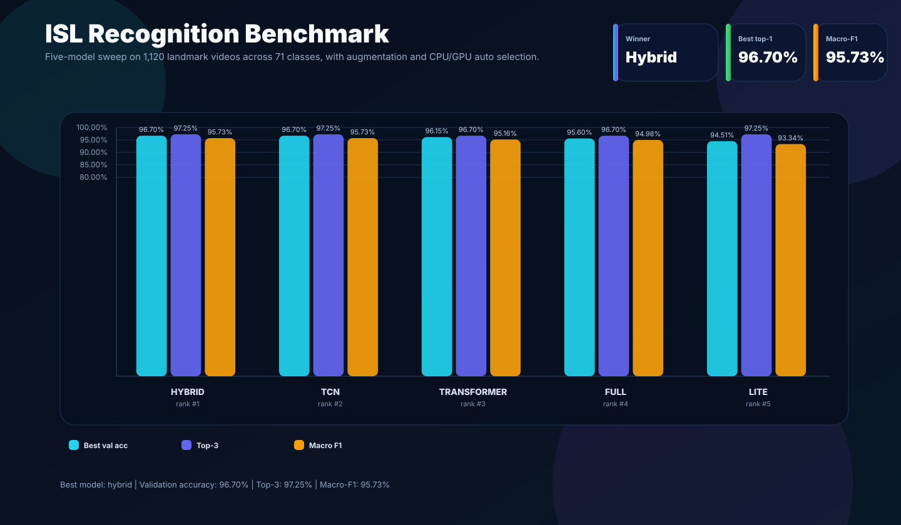
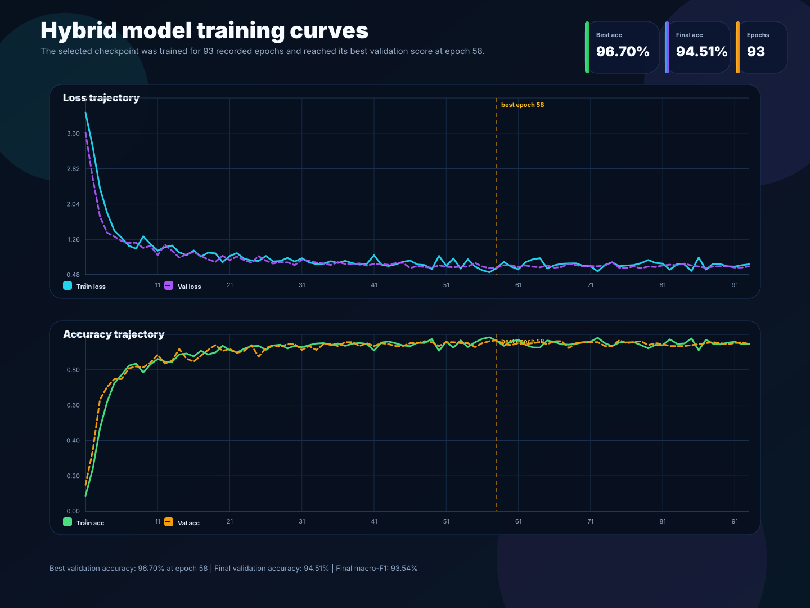
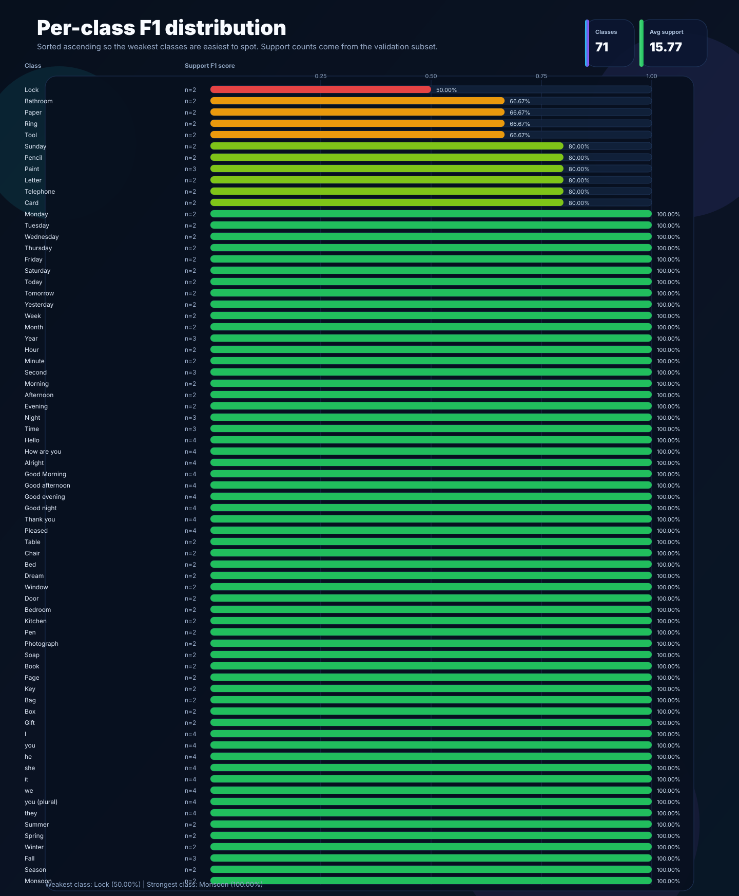

# ISL Translate: Two-Way Indian Sign Language Communication System

A full-stack accessibility project for two-way communication between spoken/written English and Indian Sign Language (ISL).

The system supports:

- Text to animated ISL signing.
- Browser voice input to animated ISL signing.
- Audio-file speech to ISL animation through Whisper.
- Camera-based sign to text recognition.
- Sign to speech output through browser text-to-speech.
- Optional motion-clip extraction from real ISL videos for future GLB/Three.js retargeting.

---

## Abstract

People who use Indian Sign Language often face communication barriers in education, public services, and daily interaction because most digital systems are built around spoken or written language. This project builds a practical two-way communication system that can translate typed or spoken English into animated ISL and can also recognize signs from a camera feed and convert them into text or speech.

The current text-to-avatar path uses a rule-based/NLP translation layer, a SiGML sign asset library, and the CWASA avatar runtime. The sign-to-text path uses MediaPipe landmark extraction in the browser and a trained PyTorch sequence model on the backend. The system is built as a React + TypeScript frontend with a FastAPI backend.

---

## Project Objectives

1. Convert typed English text into ISL gloss and animated signing.
2. Convert spoken English into text and then into animated ISL.
3. Recognize user-performed signs through webcam input.
4. Convert recognized signs into readable text and optional speech output.
5. Provide a usable UI for translation, animation playback, recognition feedback, and project demonstration.
6. Maintain a modular backend so motion datasets, SiGML assets, and trained recognition models can evolve independently.

---

## Current Feature Set

| Feature | Status | Implementation |
|---|---:|---|
| Text to ISL animation | Working | React translator page, FastAPI SiGML route, CWASA playback |
| Browser speech input to ISL animation | Working | Web Speech API in the frontend, then SiGML playback |
| Audio upload speech to ISL animation | Working | Whisper transcription route at `/api/sigml/voice`, then CWASA playback |
| Sign to text | Working if model assets are present | MediaPipe browser landmarks + PyTorch recognizer |
| Sign to speech | Working | Recognized signs are spoken through Web Speech Synthesis |
| Sentence completion for recognized signs | Optional | Groq LLM converts gloss words to a natural sentence |
| Static sign vision fallback | Optional | Groq vision model can classify static signs from a frame |
| Motion clip library from videos | Optional research path | MediaPipe Holistic extraction into `.npz` motion clips |
| Three.js/GLB retargeting | Experimental/optional | Backend animation endpoints still generate landmark frames |

---

## High-Level Architecture

```text
User text / browser speech / uploaded audio
        |
        v
React Translator Page
        |
        v
POST /api/sigml/translate or POST /api/sigml/voice
        |
        v
Whisper transcription when audio is uploaded
        |
        v
Token cleanup + ISL stop-word filtering
        |
        v
SiGML asset sequence (/SignFiles/*.sigml)
        |
        v
CWASA.playSiGMLURL(url, 0)
        |
        v
Animated signing avatar
```

```text
User signing in webcam
        |
        v
React Sign Recognition Page
        |
        v
MediaPipe Hands + Pose + GestureRecognizer
        |
        v
Normalized landmark frame sequence
        |
        v
POST /api/recognize/frame
        |
        v
PyTorch sequence classifier
        |
        v
Recognized sign + confidence + top-k predictions
        |
        v
Text output + optional speech synthesis
```

---

## System Components

| Layer | Component | Responsibility |
|---|---|---|
| Frontend | React 19 + TypeScript | UI pages, routing, camera capture, speech input, playback controls |
| Frontend | Vite | Development server, asset serving, production build |
| Frontend | CWASA runtime | Avatar rendering and SiGML animation playback |
| Frontend | MediaPipe Tasks Vision | Browser hand/pose detection for sign recognition |
| Frontend | Web Speech API | Browser speech input and text-to-speech output |
| Backend | FastAPI | REST APIs, WebSocket APIs, static SignFiles serving |
| Backend | NLTK + spaCy | Tokenization, POS tagging, ISL grammar preprocessing |
| Backend | OpenAI Whisper | Audio-file speech-to-text transcription |
| Backend | PyTorch | Sign recognition model inference |
| Backend | Groq API | Optional sentence completion and static vision fallback |
| Backend | SQLite + cachetools | Translation history and response caching |
| Dataset | `frontend/public/SignFiles` | SiGML signs used by CWASA |
| Dataset | `isl/models/best_model.pt` | Trained sign recognition checkpoint |
| Dataset | `isl/extracted_data` | Local extracted landmark dataset |
| Dataset | `isl/motion_clips` | Optional clips extracted from real videos |

---

## Text or Voice to Sign Animation

### Active Runtime

The active animation page is implemented with CWASA and SiGML. This path does not need a recognition model. It plays existing sign assets on the avatar.

Main files:

| File | Purpose |
|---|---|
| `frontend/src/pages/TranslatorPage.tsx` | Main text/voice to ISL UI and playback deck |
| `frontend/src/pages/TranslatorPage.module.css` | Compact animation page layout and playback styling |
| `frontend/src/api/sigmlApi.ts` | Client for `/api/sigml/translate`, `/api/sigml/voice`, and accessibility translation |
| `frontend/src/hooks/useCWASA.ts` | CWASA script bootstrapping, queue management, playback |
| `backend/api/routes/sigml_translate.py` | Text/audio to SiGML asset sequence API |
| `backend/services/whisper_engine.py` | Whisper audio transcription service for uploaded speech |
| `frontend/public/SignFiles` | SiGML sign assets |
| `frontend/public/js/allcsa.js` | CWASA runtime bundle |
| `frontend/public/jas/loc2021` | CWASA avatar assets |

### Pipeline Steps

1. User enters text, speaks through the browser microphone, or uploads an audio file.
2. Browser microphone speech is converted to text in the frontend with the Web Speech API.
3. Uploaded audio is sent to `POST /api/sigml/voice`, transcribed by Whisper, and returned as text plus a sign sequence.
4. Typed/browser-transcribed text calls `POST /api/sigml/translate`.
5. The backend cleans punctuation, lowercases words, removes ISL stop words, and maps known words to `.sigml` files.
6. Unknown words are fingerspelled character-by-character using letter/number SiGML files.
7. The frontend receives a sequence like `/SignFiles/hello.sigml`, `/SignFiles/how.sigml`, `/SignFiles/you.sigml`.
8. `useCWASA` queues the signs and calls `CWASA.playSiGMLURL(url, 0)` for each item.
9. CWASA loads the SiGML and animates the avatar.
10. The playback deck shows current sign, progress, queue state, replay, stop, and gloss copy controls.

### Important CWASA Detail

CWASA expects:

```ts
CWASA.playSiGMLURL(url, avatarIndex)
```

The correct call is:

```ts
window.CWASA.playSiGMLURL(resolvedURL, 0)
```

Passing `(0, resolvedURL)` makes the avatar load but not perform the actual signs.

### Current UI Improvements

The translator page now uses a compact report/demo-friendly layout:

- The avatar stage height is capped with `clamp(330px, 47vh, 500px)` so it no longer consumes the whole screen.
- Input, quick phrases, generated gloss, and playback status are separated into clean panels.
- The playback controller is now a dedicated motion deck below the avatar.
- The avatar controller supports play/resume, pause, stop, replay, frame stepping, and speed presets.
- Uploaded audio clips can be transcribed with Whisper and immediately replayed as an avatar sign sequence.
- Individual gestures can be searched from the SiGML catalog and played directly without translating a full sentence.
- Accessibility controls include voice-to-text language selection, optional speech output, and multilingual text translation when `GROQ_API_KEY` is configured.
- The queue shows pending, playing, and played states.
- The progress bar tracks the active sign sequence.
- Replay, stop, and copy gloss controls are always near the animation.
- The layout switches to a single-column mobile view below 1040px.

---

## Sign to Text and Speech

The sign recognition page converts a camera feed into recognized signs, text, and optional speech.

Main files:

| File | Purpose |
|---|---|
| `frontend/src/pages/SignRecognitionPage.tsx` | Webcam UI, MediaPipe detection, recognition display, TTS |
| `frontend/src/api/recognizeApi.ts` | Client for recognition endpoints |
| `backend/api/routes/recognize.py` | Recognition API, sentence completion, vision fallback |
| `isl/src/ml/recognizer.py` | Sliding-window recognizer around the trained model |
| `isl/src/ml/model.py` | PyTorch model definitions |
| `isl/models/best_model.pt` | Trained recognition model checkpoint |

### Sign Recognition Pipeline

1. User opens the Sign to Text page and starts the camera.
2. The browser loads MediaPipe Tasks Vision models.
3. MediaPipe extracts hand landmarks and pose landmarks from the video stream.
4. The frontend sends landmark frames to `POST /api/recognize/frame`.
5. The backend lazy-loads `isl/models/best_model.pt` on first use.
6. The recognizer normalizes landmarks into a fixed feature vector.
7. A sliding window of recent frames is classified by the PyTorch model.
8. The backend returns current sign, confidence, top-k predictions, frame count, and buffer size.
9. The frontend commits a sign only after it is held long enough to avoid noisy duplicates.
10. Recognized signs are appended to the sentence panel.
11. If TTS is enabled, each recognized sign or completed sentence is spoken with browser speech synthesis.

### Recognition Model

The project includes PyTorch sequence models for landmark-based ISL recognition.

Supported model classes in `isl/src/ml/model.py`:

| Model | Description |
|---|---|
| `ISLModel` | Baseline bidirectional GRU with attention pooling |
| `ISLModelLite` | Smaller CNN + BiGRU variant for lower latency |
| `ISLModelHybrid` | Hand-aware temporal model with velocity features, temporal convolutions, BiGRU, and attention |
| `ISLModelTransformer` | Transformer encoder with velocity features for longer temporal context |
| `ISLModelTCN` | Dilated temporal convolution model for fast small-dataset benchmarking |

The recognizer loads the model checkpoint from:

```text
isl/models/best_model.pt
```

The current backend recognizer uses:

| Setting | Value |
|---|---|
| Device | CPU by default |
| Window size | Loaded from checkpoint, commonly 30 frames |
| Input features | Right hand, left hand, selected pose landmarks, hand presence flags |
| Classes | Loaded from the benchmark-selected checkpoint, currently 71 classes |
| Prediction filter | Confidence threshold, margin threshold, entropy threshold, active-hand ratio |

### Model Accuracy and Metrics

The latest benchmark artifacts are stored in:

```text
isl/models/benchmark/benchmark_results.json
isl/models/benchmark/benchmark_results.csv
isl/models/benchmark/hybrid_seed42/metrics.json
```

Current benchmark summary:

| Metric | Value |
|---|---:|
| Number of classes | 71 |
| Total landmark samples | 1,120 |
| Successful extractions | 1,120 |
| Benchmark model family | hybrid, tcn, transformer, full, lite |
| Best model | hybrid |
| Best validation accuracy | 96.70% |
| Best top-3 accuracy | 97.25% |
| Best top-5 accuracy | 97.25% |
| Best macro F1 | 95.73% |
| Best validation epoch | 58 |
| Training epochs recorded | 93 |
| Final training accuracy | 94.61% |
| Final validation accuracy | 94.51% |
| Final training loss | 0.7151 |
| Final validation loss | 0.6685 |
| Benchmark runtime | 5,722.98 seconds |
| Selected deployment checkpoint | `isl/models/best_model.pt` |

Benchmark ranking:

| Rank | Model | Val Acc | Top-3 | Top-5 | Macro F1 | Best Epoch |
|---:|---|---:|---:|---:|---:|---:|
| 1 | Hybrid | 96.70% | 97.25% | 97.25% | 95.73% | 58 |
| 2 | TCN | 96.70% | 97.25% | 97.25% | 95.73% | 61 |
| 3 | Transformer | 96.15% | 96.70% | 96.70% | 95.16% | 56 |
| 4 | Full | 95.60% | 96.70% | 97.25% | 94.98% | 44 |
| 5 | Lite | 94.51% | 97.25% | 97.25% | 93.34% | 36 |

#### Benchmark Visuals







The per-class chart is sorted ascending so the weakest classes are easy to inspect. The full confusion-matrix CSV is available at `isl/models/benchmark/hybrid_seed42/confusion_matrix.csv` for deeper analysis.

Important interpretation for the report: this benchmark is strong enough for a demo-ready recognizer, but because the dataset is still relatively small and the per-class support is uneven, the report should still describe the result as benchmarked experimental performance rather than final production accuracy.

For presentation, describe the current result as:

```text
The implemented sign-recognition system now supports 71 ISL classes and was benchmarked on 1,120 landmark videos. The best checkpoint reached 96.70% validation accuracy with 95.73% macro F1, showing a strong prototype recognizer with room for more data and a held-out test split.
```

### Training Upgrade for 90%+ Target

The project now includes a stronger training workflow for improving the recognition model instead of relying on one baseline checkpoint. The benchmark sweep above already clears the 90% target.

Important files:

| File | Purpose |
|---|---|
| `training-rq.txt` | Training-only Python requirements |
| `isl/src/ml/train.py` | Single-model training with CPU/GPU auto selection |
| `isl/src/ml/benchmark.py` | Trains multiple model families and compares real metrics |
| `isl/src/ml/model.py` | Model zoo: hybrid, transformer, TCN, full GRU, lite |
| `isl/src/ml/dataset.py` | Stratified loaders, weighted sampling, configurable augmentation |
| `docs/figures/*.svg` | Report-ready visuals for README and presentation slides |

Recommended install:

```bash
pip install -r training-rq.txt
```

Benchmark several architectures:

```bash
cd isl
python -m src.ml.benchmark --data-dir extracted_data --output-dir models/benchmark --device auto --epochs 180 --batch-size 32 --augment-repeats 3
```

Train one strong model after benchmark selection:

```bash
cd isl
python -m src.ml.train --data-dir extracted_data --output-dir models --model-type hybrid --device auto --epochs 220 --batch-size 32 --augment-repeats 3 --patience 45
```

CPU-only training:

```bash
cd isl
python -m src.ml.train --data-dir extracted_data --output-dir models --model-type tcn --device cpu --epochs 180
```

NVIDIA GPU training:

```bash
cd isl
python -m src.ml.benchmark --data-dir extracted_data --output-dir models/benchmark --device cuda --epochs 220 --batch-size 64 --augment-repeats 4
```

Generated training artifacts:

| Artifact | Purpose |
|---|---|
| `best_model.pt` | Best validation checkpoint for backend inference |
| `last_model.pt` | Final checkpoint from the run |
| `training_history.json` | Loss, top-1, top-3, top-5, macro-F1 over epochs |
| `metrics.json` | Best/final metrics, per-class scores, config, dataset metadata |
| `confusion_matrix.csv` | Per-class confusion matrix for report analysis |
| `benchmark_results.csv` | Ranked model comparison table |
| `benchmark_results.json` | Machine-readable benchmark summary |

To honestly claim 90%+ accuracy in the report, use the value from `metrics.json` or `benchmark_results.csv` after a completed run. If you want to push the benchmark even higher, the next step is more data per class, cleaner signer/camera consistency, a stricter held-out test split, and longer training rather than changing the displayed metric.

### Landmark Feature Format

The model input is based on normalized MediaPipe landmarks:

| Feature group | Size |
|---|---:|
| Right hand | 21 landmarks x 3 = 63 |
| Left hand | 21 landmarks x 3 = 63 |
| Selected pose landmarks | 10 landmarks x 3 = 30 |
| Hand presence flags | 2 |
| Total | 158 features per frame |

### Sentence Completion and Speech

Raw recognized signs are often gloss-like, not natural English. The backend can call Groq to convert a list of recognized signs into a natural sentence through:

```text
POST /api/recognize/complete-sentence
```

The frontend can then speak the completed sentence using `SpeechSynthesisUtterance`.

Optional Groq settings:

```env
GROQ_API_KEY=your_key_here
GROQ_TEXT_MODEL=llama-3.3-70b-versatile
GROQ_VISION_MODEL=meta-llama/llama-4-scout-17b-16e-instruct
```

---

## Optional Landmark and Motion-Clip Animation Path

The earlier/experimental Three.js style path still exists on the backend. It is useful for research, generated landmark animation, and future GLB retargeting.

Main files:

| File | Purpose |
|---|---|
| `backend/api/routes/translate.py` | Full NLP + landmark animation translation endpoints |
| `backend/api/routes/animation.py` | Generate animation from a gloss sequence |
| `backend/services/nlp_engine.py` | NLTK/spaCy grammar processing |
| `backend/services/sign_generator.py` | SLT, motion clips, dataset, procedural pose lookup |
| `backend/services/animation_engine.py` | Frame generation, interpolation, idle motion |
| `isl/tools/extract_motion.py` | Extract body/hand motion clips from videos |
| `isl/motion_clips` | Extracted `.npz` clip library |

### Backend Animation Source Priority

When the backend landmark animation path is used, the animation engine tries sources in this order:

1. Sign-language-translator concatenative synthesis, if available.
2. Motion clips extracted from real ISL videos.
3. Local extracted ISL landmark dataset.
4. Procedural landmark fallback.

### Motion Clip Extraction

Use this when you want real recorded signing motion as a dataset for future retargeting:

```bash
python isl/tools/extract_motion.py --data-dir isl/data --output-dir isl/motion_clips --fps 24 --max-frames 220 --trim-static
```

Output structure:

```text
isl/motion_clips/
  metadata.json
  hello/
    hello__0.npz
  thank_you/
    thank_you__0.npz
```

This is not required for the active CWASA text-to-sign path.

---

## API Reference

### Text and Voice to Sign

#### `POST /api/sigml/translate`

Active endpoint used by the translator page.

Request:

```json
{
  "text": "Hello, how are you?"
}
```

Response:

```json
{
  "input": "Hello, how are you?",
  "gloss": "hello how you",
  "tokenCount": 3,
  "sequence": [
    { "id": 1, "value": "hello", "kind": "sign", "asset": "/SignFiles/hello.sigml" },
    { "id": 2, "value": "how", "kind": "sign", "asset": "/SignFiles/how.sigml" },
    { "id": 3, "value": "you", "kind": "sign", "asset": "/SignFiles/you.sigml" }
  ]
}
```

#### `POST /api/sigml/voice`

Active endpoint used by the translator page for uploaded audio files.

Request type:

```text
multipart/form-data
```

Fields:

| Field | Description |
|---|---|
| `audio` | Audio file such as WAV, MP3, M4A, OGG, WEBM, or FLAC |
| `language` | Whisper language hint such as `en`, `hi`, or `en-IN`; default `en` |

Response:

```json
{
  "input": "Hello, how are you?",
  "transcribedText": "Hello, how are you?",
  "detectedLanguage": "en",
  "duration": 2.4,
  "gloss": "hello how you",
  "tokenCount": 3,
  "sequence": [
    { "id": 1, "value": "hello", "kind": "sign", "asset": "/SignFiles/hello.sigml" }
  ]
}
```

Pipeline:

```text
Audio file -> Whisper transcription -> /api/sigml text cleanup -> SiGML sequence -> CWASA avatar playback
```

#### `POST /api/sigml/translate-language`

Optional accessibility endpoint for translating the current text into another spoken/written language. Requires `GROQ_API_KEY`.

Request:

```json
{
  "text": "Hello, how are you?",
  "source_language": "auto",
  "target_language": "Hindi"
}
```

Response:

```json
{
  "input": "Hello, how are you?",
  "translatedText": "नमस्ते, आप कैसे हैं?",
  "sourceLanguage": "auto",
  "targetLanguage": "Hindi"
}
```

#### `POST /translate/text`

Legacy/experimental full NLP + landmark animation endpoint.

Request:

```json
{
  "text": "What is your name?",
  "language": "en",
  "isl_grammar": true
}
```

Response includes:

- Original text.
- Simplified text.
- ISL gloss sequence.
- NLP token breakdown.
- Landmark animation frames.
- Confidence score.
- Processing time.

#### `POST /translate/voice`

Legacy/experimental audio-file speech endpoint for the older landmark animation pipeline. The active avatar UI now uses `POST /api/sigml/voice`.

Request type:

```text
multipart/form-data
```

Fields:

| Field | Description |
|---|---|
| `audio` | Audio file such as WAV, MP3, OGG, or WEBM |
| `language` | Speech language, default `en` |
| `isl_grammar` | Whether to apply ISL grammar rules |

Pipeline:

```text
Audio file -> Whisper transcription -> NLP -> gloss -> animation
```

### Sign Recognition

#### `POST /api/recognize/frame`

Receives one landmark frame and returns the current prediction.

Request:

```json
{
  "right_hand": [[0.1, 0.2, 0.0]],
  "left_hand": null,
  "pose": [[0.5, 0.3, 0.0, 0.9]]
}
```

Response:

```json
{
  "sign": "HELLO",
  "confidence": 0.87,
  "top_k": [
    { "sign": "HELLO", "confidence": 0.87 },
    { "sign": "THANK_YOU", "confidence": 0.08 }
  ],
  "frame_count": 42,
  "buffer_size": 30
}
```

#### `POST /api/recognize/reset`

Clears the recognition buffer.

#### `GET /api/recognize/status`

Returns model availability, model path, class count, window size, and confidence threshold.

#### `GET /api/recognize/classes`

Returns the trained class names.

#### `POST /api/recognize/complete-sentence`

Converts recognized gloss words into a natural sentence using Groq.

Request:

```json
{
  "words": ["I", "HELP", "NEED"]
}
```

Response:

```json
{
  "sentence": "I need help."
}
```

#### `POST /api/recognize/vision`

Optional static image fallback for signs such as letters or numbers.

Request:

```json
{
  "image_base64": "data:image/jpeg;base64,..."
}
```

### System and Utility

| Endpoint | Purpose |
|---|---|
| `GET /` | Backend root status |
| `GET /system/status` | Health and model status |
| `GET /system/signs` | Available procedural signs |
| `POST /animation/generate` | Generate landmark animation from gloss sequence |
| `GET /translate/history` | Translation history |
| `DELETE /translate/history` | Clear history |
| `WS /realtime/translate` | Streaming NLP and animation events |

---

## ISL Grammar Logic

Indian Sign Language often uses a different order than English. The backend NLP engine applies simplified ISL-friendly grammar rules.

Important transformations:

| English pattern | ISL-oriented behavior |
|---|---|
| Subject-Verb-Object | Reordered toward Subject-Object-Verb |
| WH questions | Question words moved to the end |
| Auxiliaries | Words like is, am, are, do, did, will are removed |
| Articles | a, an, the are removed |
| Function words | Many prepositions/conjunctions are removed or simplified |
| Gloss | Kept tokens are uppercased in the landmark path |

Examples:

| English | ISL-style gloss |
|---|---|
| What is your name? | YOUR NAME WHAT |
| I need help | I HELP NEED |
| She is eating food | SHE FOOD EAT |
| Where is the school? | SCHOOL WHERE |

The active SiGML path uses a lighter direct asset lookup so it can match filenames reliably.

---

## Dataset and Assets

### SiGML Sign Library

Location:

```text
frontend/public/SignFiles
```

Purpose:

- Stores `.sigml` sign files.
- Used directly by CWASA for text/voice to avatar animation.
- Served by Vite in development and by FastAPI at `/SignFiles`.

Current asset metrics:

| Metric | Value |
|---|---:|
| SiGML files | 848 |
| Backend word entries | 849 |

### Recognition Model

Location:

```text
isl/models/best_model.pt
```

Purpose:

- Stores PyTorch checkpoint for sign-to-text classification.
- Includes class names and model hyperparameters.
- Loaded lazily by `/api/recognize/status` or `/api/recognize/frame`.

Current dataset metrics:

| Metric | Value |
|---|---:|
| Classes | 71 |
| Total samples | 1,120 |
| Minimum samples per class | 14 |
| Maximum samples per class | 22 |
| Average samples per class | 15.77 |

### Extracted Landmark Dataset

Location:

```text
isl/extracted_data
```

Purpose:

- Stores pre-extracted landmark sequences.
- Used by optional backend landmark animation path.

### Motion Clip Dataset

Location:

```text
isl/motion_clips
```

Purpose:

- Stores real motion clips extracted from ISL videos.
- Intended for future avatar retargeting and more natural movement.

Current motion-clip metrics:

| Metric | Value |
|---|---:|
| Signs covered | 71 |
| Total clips | 1,120 |
| FPS | 24 |
| Average frames per clip | 57.55 |
| Frame range | 34-134 |
| Average extraction quality score | 0.8670 |
| Average left-hand coverage | 0.8307 |
| Average right-hand coverage | 0.6871 |

---

## Technology Stack

### Frontend

| Technology | Use |
|---|---|
| React 19 | Component-based UI |
| TypeScript | Type safety |
| Vite | Dev server and build tool |
| Framer Motion | UI transitions and playback motion feedback |
| Lucide React | Icons |
| MediaPipe Tasks Vision | Browser hand, pose, and gesture tracking |
| CWASA | SiGML avatar playback |
| Web Speech API | Browser speech recognition and speech synthesis |
| Axios/fetch | API requests |
| Zustand | State store for older landmark animation path |
| Three.js/R3F | Optional previous 3D/GLB animation tooling |

### Backend

| Technology | Use |
|---|---|
| Python 3.11+ | Backend runtime |
| FastAPI | REST and WebSocket APIs |
| Uvicorn | ASGI server |
| Pydantic | Request/response validation and settings |
| NLTK | Tokenization, POS tagging fallback, stop words |
| spaCy | Richer NLP analysis when model is available |
| OpenAI Whisper | Audio transcription |
| PyTorch | Sign recognition inference |
| NumPy | Landmark preprocessing |
| MediaPipe | Offline motion extraction and landmark tooling |
| Groq SDK | Optional LLM sentence completion and vision fallback |
| SQLite/aiosqlite | History storage |
| cachetools | In-memory response cache |
| Loguru | Structured logging |

---

## Setup

### Prerequisites

| Tool | Recommended version |
|---|---|
| Python | 3.11 or compatible project Python |
| Node.js | 20+ |
| npm | 9+ |
| ffmpeg | Required for Whisper audio processing |

### Environment

Create your environment file:

```bash
cp .env.example .env
```

On Windows PowerShell:

```powershell
Copy-Item .env.example .env
```

Set `GROQ_API_KEY` only if you want sentence completion and vision fallback.

### Backend

```bash
cd backend
python -m venv venv
venv\Scripts\activate
pip install -r requirements.txt
python -m spacy download en_core_web_sm
uvicorn main:app --host 0.0.0.0 --port 8000 --reload
```

If you use the root `.venv` instead:

```bash
.venv\Scripts\activate
uvicorn backend.main:app --host 0.0.0.0 --port 8000 --reload
```

### Frontend

```bash
cd frontend
npm install
npm run dev
```

Open:

```text
http://localhost:5173
```

### Docker

```bash
docker-compose up --build
```

---

## Environment Variables

| Variable | Default | Purpose |
|---|---|---|
| `APP_NAME` | `ISL Translation System` | Backend app name |
| `APP_VERSION` | `1.0.0` | App version shown in system status |
| `DEBUG` | `false` | Enables debug behavior |
| `HOST` | `0.0.0.0` | Backend host |
| `PORT` | `8000` | Backend port |
| `CORS_ORIGINS` | localhost frontend origins | Allowed browser origins |
| `WHISPER_MODEL` | `base` | Whisper model size |
| `WHISPER_DEVICE` | `cpu` | Whisper device |
| `WHISPER_LANGUAGE` | `en` | Default transcription language |
| `SPACY_MODEL` | `en_core_web_sm` | spaCy model name |
| `ANIMATION_FPS` | `30` | Landmark animation FPS |
| `INTERPOLATION_FRAMES` | `10` | Frames between generated poses |
| `IDLE_ANIMATION_ENABLED` | `true` | Idle breathing for landmark path |
| `DATABASE_URL` | SQLite local file | Translation history database |
| `CACHE_MAX_SIZE` | `256` | In-memory cache size |
| `GROQ_API_KEY` | empty | Optional Groq features |
| `GROQ_TEXT_MODEL` | `llama-3.3-70b-versatile` | Sentence completion model |
| `GROQ_VISION_MODEL` | `meta-llama/llama-4-scout-17b-16e-instruct` | Static sign vision fallback model |
| `SLT_DATASET_DIR` | `./slt_data` | Sign-language-translator data directory |
| `ISL_LANDMARKS_DIR` | `../isl/extracted_data` | Landmark dataset root |
| `ISL_DATASET_FPS` | `15` | Dataset FPS |
| `ISL_MOTION_CLIPS_DIR` | `../isl/motion_clips` | Motion clips root |

---

## External Model Reference

The default Groq vision fallback model is `meta-llama/llama-4-scout-17b-16e-instruct`, which Groq documents as supporting text and image input with vision capability: [Groq Llama 4 Scout docs](https://console.groq.com/docs/model/llama-4-scout-17b-16e-instruct).

---

## Project Structure

```text
indian-sign-language-two-way-communication/
  backend/
    api/
      routes/
        sigml_translate.py      # active text to SiGML route
        recognize.py            # sign recognition route
        translate.py             # legacy/full NLP + landmark animation route
        animation.py             # landmark animation generation
        system.py                # health/status APIs
      websocket.py               # realtime translation websocket
    services/
      nlp_engine.py              # English to ISL grammar processing
      whisper_engine.py          # audio transcription
      sign_generator.py          # pose/dataset/motion source lookup
      animation_engine.py        # generated landmark animation frames
      cache_service.py           # history and cache
    models/
      schemas.py                 # Pydantic models
    config.py                    # settings and env variables
    main.py                      # FastAPI app entry point
    requirements.txt
  frontend/
    public/
      SignFiles/                 # SiGML sign assets
      js/allcsa.js               # CWASA runtime
      jas/loc2021/               # CWASA avatar assets
    src/
      api/
        sigmlApi.ts              # active text/audio to sign API client
        recognizeApi.ts          # sign recognition API client
      hooks/
        useCWASA.ts              # CWASA loader and queue playback
      pages/
        TranslatorPage.tsx       # text/voice to avatar page
        TranslatorPage.module.css
        SignRecognitionPage.tsx  # sign to text/speech page
      components/
      stores/
  isl/
    data/                        # source videos if present
    extracted_data/              # extracted landmarks
    motion_clips/                # extracted motion clips
    models/
      best_model.pt              # recognition checkpoint
    src/ml/
      benchmark.py               # multi-model training benchmark runner
      model.py                   # PyTorch model definitions
      recognizer.py              # real-time recognizer wrapper
      train.py                   # CPU/GPU-aware training entry point
    tools/
      extract_motion.py          # video to motion clips
  .env.example
  training-rq.txt                 # training-only dependencies
  docker-compose.yml
  README.md
```

---

## Report Notes

### Problem Statement

Communication between hearing users and ISL users is limited by the lack of accessible real-time translation tools. Existing systems often support only text or only recognition, while this project attempts a two-way workflow.

### Proposed Solution

A web-based two-way ISL communication system with:

- Text or speech input from a hearing user.
- ISL grammar simplification and gloss generation.
- Animated avatar signing through CWASA and SiGML.
- Camera-based recognition of performed signs.
- Text and speech output for recognized signs.

### Methodology

1. Build a React frontend for translation and recognition workflows.
2. Build a FastAPI backend with separate routes for translation, animation, recognition, and system status.
3. Use NLP rules to convert English into ISL-friendly gloss.
4. Use SiGML files for reliable avatar signing.
5. Use MediaPipe landmarks and a trained PyTorch temporal model for sign recognition.
6. Use browser TTS and optional Groq sentence completion to produce natural output.
7. Keep motion clip extraction available for future real-video avatar retargeting.

### Expected Evaluation Criteria

| Criterion | How to evaluate |
|---|---|
| Translation correctness | Compare generated gloss with expected ISL gloss |
| Avatar playback | Check whether each sign asset plays without skipping |
| Recognition accuracy | Benchmark winner: 96.70% validation accuracy across 71 classes, with top-k and per-class metrics included in the report |
| Latency | Measure time from input to playback or recognition update |
| Usability | Check whether controls, status, and output are clear in demo |
| Robustness | Test missing signs, unknown words, no camera, no Groq key |

### Current Quantitative Results

| Area | Current result |
|---|---|
| SiGML sign assets | 848 `.sigml` files |
| Recognition classes | 71 ISL classes |
| Recognition dataset size | 1,120 landmark sequences |
| Recognition validation accuracy | 96.70% best validation accuracy |
| Motion clip dataset | 1,120 clips across 71 signs |
| Motion clip quality score | Average 0.8670 |
| Motion clip FPS | 24 FPS |

### Limitations

- SiGML coverage depends on available files in `frontend/public/SignFiles`.
- Unknown words are fingerspelled, which is useful but not always natural ISL.
- Sign recognition quality depends on camera angle, lighting, signer distance, and the trained class set.
- Facial expressions and non-manual ISL grammar cues are limited.
- Groq features require an API key and internet access.
- Motion clip retargeting is still optional/experimental rather than the active UI path.

### Future Work

- Expand the SiGML sign library.
- Add facial expressions and non-manual markers.
- Improve phrase-level ISL grammar beyond word-level gloss mapping.
- Add signer calibration for recognition.
- Add confidence-based correction UI for sign recognition.
- Connect extracted motion clips to a rigged GLB avatar with IK retargeting.
- Add automated evaluation scripts for recognition accuracy and translation latency.

---

## Troubleshooting

### Avatar loads but does not sign

Check:

```text
http://localhost:5173/SignFiles/hello.sigml
http://localhost:8000/SignFiles/hello.sigml
```

Both should return SiGML XML.

Also confirm the frontend calls:

```ts
window.CWASA.playSiGMLURL(resolvedURL, 0)
```

### Sign recognition model is unavailable

Check that this file exists:

```text
isl/models/best_model.pt
```

Then call:

```text
http://localhost:8000/api/recognize/status
```

### Groq sentence completion fails

Check:

- `GROQ_API_KEY` is set.
- `GROQ_TEXT_MODEL` uses a supported text model.
- `GROQ_VISION_MODEL` uses a supported vision-capable model.

### MediaPipe camera does not start

Check:

- Browser camera permission is allowed.
- Use `localhost` or HTTPS.
- No other app is using the webcam.

### Dependency conflict with NumPy

The backend requirements pin NumPy below 2.0 because `sign-language-translator` expects NumPy 1.26.x.

Use:

```bash
pip install "numpy>=1.26,<2.0"
```

---

## Build and Verification

Frontend production build:

```bash
cd frontend
npm run build
```

Focused translator lint:

```bash
cd frontend
npx eslint src/pages/TranslatorPage.tsx src/hooks/useCWASA.ts
```

Backend syntax check, if Python is available:

```bash
python -m py_compile backend/main.py backend/api/routes/recognize.py backend/api/routes/sigml_translate.py
```

Training syntax check:

```bash
cd isl
python -m py_compile src/ml/model.py src/ml/dataset.py src/ml/train.py src/ml/benchmark.py src/ml/recognizer.py
```

Quick benchmark smoke test, one epoch per model:

```bash
cd isl
python -m src.ml.benchmark --data-dir extracted_data --output-dir models/smoke_benchmark --models tcn lite --epochs 1 --batch-size 16 --device cpu --no-amp
```
